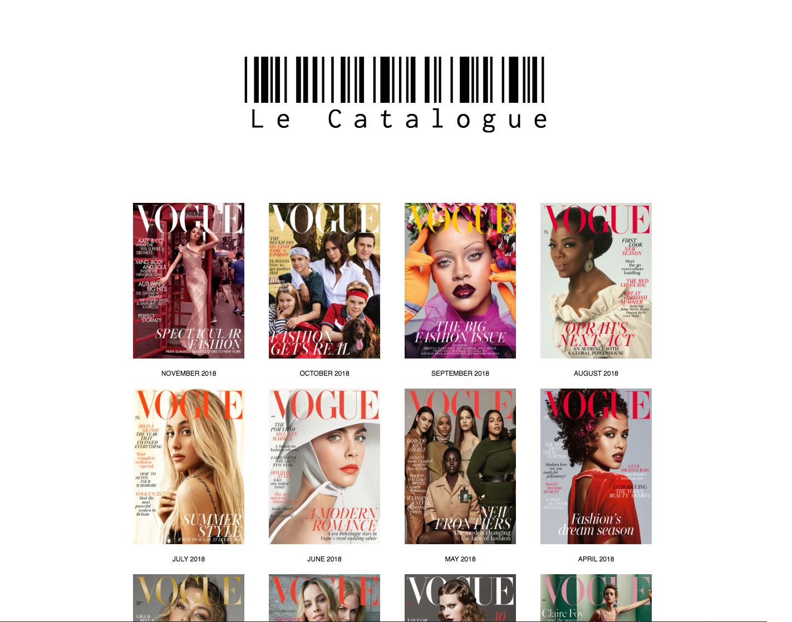

# Le Catalogue



A minimalistic front-end React App that holds information on the latest Vogue issues. Decided to take on this challenge to learn about fetching from an API with React. Data is sourced from [Conde Nast's engineering API](https://code.condenast.co.uk/docs/covers-api)

### Getting Started

First clone the repository and follow the instructions outlined below:

```
npm install
npm start

```
## Built With

* [React](https://reactjs.org/)
